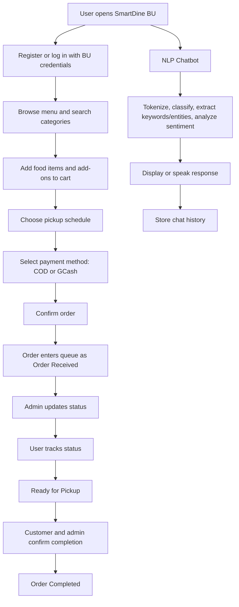
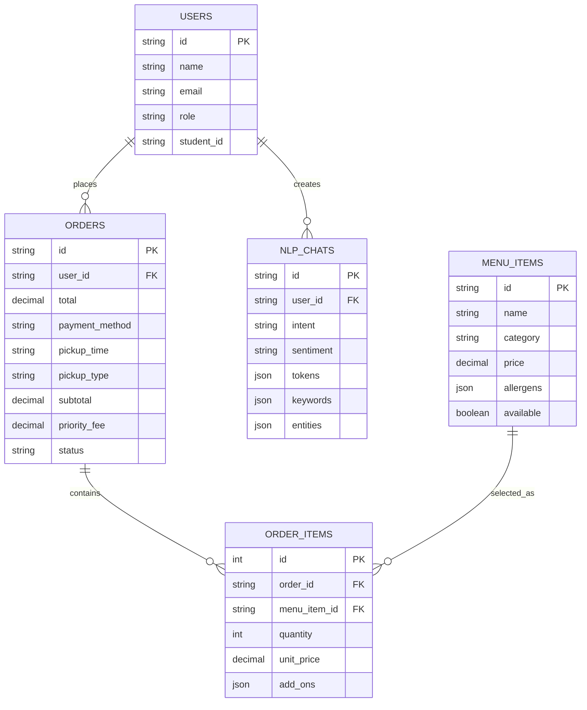

# SmartDine BU NLP Project Implementation

SmartDine BU was developed as a responsive web-based canteen ordering and queue system for the Bicol University Polangui community. The system includes registration and login, menu browsing, pre-ordering, COD and GCash payment options, order tracking, admin order management, allergen information, ASAP pickup, and an NLP chatbot for common canteen-related questions.

Technologies used:

- Frontend: React, HTML, CSS, Tailwind, JavaScript/TypeScript
- Backend/runtime: Node.js/Vite, deployed on Vercel
- Database/backend service: Supabase PostgreSQL
- Database file: `database/smartdine_supabase_schema.sql`
- Payment flow: COD and GCash proof-of-payment upload
- NLP tools/APIs: local JavaScript/TypeScript NLP module and browser Web Speech API
- Design/development/deployment tools: Figma UI prototype/reference, VS Code, GitHub, and Vercel
- Runtime requirements: modern browser with JavaScript enabled, browser storage enabled, optional microphone permission, and stable internet connection
- Device compatibility: mobile, tablet, laptop, and desktop layouts
- Evaluation focus: usability, performance, and reliability as guided by ISO/IEC 25010

Note on the database requirement: Chapter 3 mentioned MongoDB, while the NLP instruction also mentioned MySQL as a recommended database option. For the actual deployed system, I used Supabase PostgreSQL because it already provides the database, API access, authentication support, and row-level security needed by the project.

For a complete Chapter 1-3 mapping, see `SYSTEM_REQUIREMENTS_ALIGNMENT.md`.

## Implemented NLP Features

1. Tokenization
   - User text is split into word tokens.
   - The latest tokens can be viewed through the chatbot's NLP details toggle.

2. Sentiment Analysis
   - Positive, negative, and neutral sentiment are detected using keyword scoring.
   - The sentiment result and score can also be viewed through the chatbot's NLP details toggle.

3. Chatbot System
   - The chatbot answers SmartDine-related questions about ordering, menu recommendations, allergens, feedback, and complaints.
   - Conversation history is stored in Supabase through `public.nlp_chat_messages` when the user is logged in.

4. Voice-to-Text
   - The microphone button uses the browser Web Speech API to convert speech into text.
   - This works best in Chrome or Edge.

5. Text-to-Speech
   - The Speak button reads the chatbot response aloud using browser speech synthesis.

6. Keyword Extraction and Text Classification
   - Important words are extracted from the user's message.
   - Messages are classified into intents such as Menu Inquiry, Budget Inquiry, Allergen Inquiry, Ordering Help, Queue Status Inquiry, Payment Inquiry, Complaint, and Feedback.

7. Named Entity Recognition and Context Memory
   - Food names such as Adobo, Tapsilog, and Kare-Kare are detected even from very short inputs.
   - The chatbot remembers the last detected menu item, so follow-up questions like "how much?" can use the previous context.

## Demo

The chatbot can be opened using the floating SmartDine Chatbot button at the bottom-right of the system. On mobile, the same chatbot opens in a larger phone-friendly panel. The separate `/nlp-chatbot` page redirects to the home page so the system only uses one chatbot interface.

Sample inputs:

```text
Recommend budget meals under 60
What food has peanuts?
How do I order?
I love the food
Adobo?
How much?
Drinks?
No soy please
Do you have burger?
The order is late and cold
```

## Database

The deployed system uses Supabase PostgreSQL for user profiles, menu items, orders, order items, and NLP chat messages. Authentication and order creation use Supabase when `VITE_SUPABASE_URL` and `VITE_SUPABASE_ANON_KEY` are configured. Browser storage is still used for temporary cart and UI state. The SQL export also includes an Auth trigger that automatically creates `public.profiles` records for new users.

```text
database/smartdine_supabase_schema.sql
```

## Responsive Interface Implementation

The system supports both computer and mobile views through responsive Tailwind CSS classes in the page components and app shell.

- `src/app/components/RootLayout.tsx` changes the desktop navigation row into a compact mobile menu.
- `src/app/components/ChatBot.tsx` uses a desktop floating widget and a mobile-safe panel that fits within the viewport.
- `src/app/components/NotificationPanel.tsx` uses mobile-safe width and height constraints.
- `src/app/pages/HomePage.tsx`, `MenuPage.tsx`, `CartPage.tsx`, `CheckoutPage.tsx`, `PaymentPage.tsx`, `MyOrdersPage.tsx`, and `OrderStatusPage.tsx` use responsive spacing, typography, grids, cards, and action buttons.
- `src/app/pages/AdminDashboardPage.tsx`, `OrderManagementPage.tsx`, and `MenuManagementPage.tsx` adapt admin cards, filters, and management actions for smaller screens.
- Modals use viewport-based height limits and internal scrolling to prevent content from being cut off on phones.

## System Flowchart



## ER Diagram



## Defense Explanation

In this project, NLP is applied by accepting natural language input, tokenizing the text, detecting sentiment, extracting keywords, recognizing menu items/allergens/categories, classifying the user's intent, generating a SmartDine-related response, supporting voice input/output, and storing the chat history.

## Source Code Locations for Defense

- Tokenization, sentiment analysis, keyword extraction, entity matching, intent classification, and chatbot response generation: `src/app/utils/nlp.ts`
- Floating chatbot interface, microphone button, Speak button, and NLP details toggle: `src/app/components/ChatBot.tsx`
- Supabase storage of NLP chat logs: `src/app/services/chatHistoryService.ts`
- User registration, login, and admin-role checks: `src/app/contexts/AuthContext.tsx`
- Supabase client environment-variable setup: `src/app/lib/supabase.ts`
- Menu data, categories, add-ons, and allergen fields: `src/app/data/menuData.ts`
- Menu page allergen warning icons and add-on modal: `src/app/pages/MenuPage.tsx`
- Checkout ASAP priority fee and pickup validation: `src/app/pages/CheckoutPage.tsx` and `src/app/utils/pickup.ts`
- Order persistence and order-item persistence in Supabase: `src/app/services/orderService.ts`
- Admin dashboard/order management/menu management: `src/app/pages/AdminDashboardPage.tsx`, `src/app/pages/OrderManagementPage.tsx`, and `src/app/pages/MenuManagementPage.tsx`
- Database schema, RLS policies, admin setup, and seed menu data: `database/smartdine_supabase_schema.sql`
